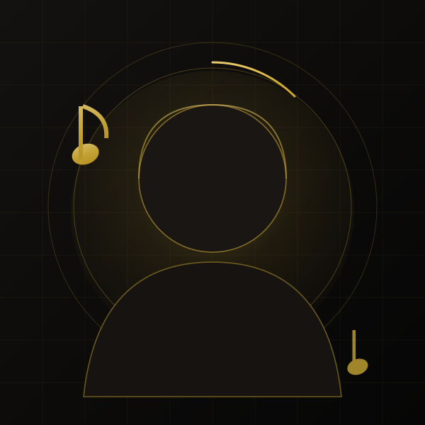

# 🎬 لندینگ پیج ابوالفضل میرعمو

صفحه‌ی فرود تک‌صفحه‌ای، سینمایی و کاملاً راست‌به‌چپ (RTL) برای معرفی و فروش خدمات
**آموزش آواز، آهنگسازی و تنظیم، اجرای زنده و مجری‌گری مراسم**.

> حس کلی صفحه: افتتاح یک کنسرت — صحنه‌ی تاریک، نور طلایی، و داستانی که تازه شروع می‌شود.

| ویژگی | وضعیت |
| --- | --- |
| فناوری | HTML5 + CSS3 + JavaScript خالص (بدون فریم‌ورک، بدون مرحله‌ی Build) |
| وابستگی‌های CDN | **صفر** — فونت، آیکون، اسلایدر و همه‌ی تصاویر به‌صورت محلی سرو می‌شوند |
| اسلایدر نظرات | Swiper 11 (نسخه‌ی محلی در `assets/vendor/`) |
| انیمیشن‌ها | IntersectionObserver + CSS Keyframes + دو افکت Canvas |
| دسترس‌پذیری | ناوبری با کیبورد، `aria-*` کامل، کنتراست AA/AAA، احترام به `prefers-reduced-motion` |
| سرعت | بدون فونت وب خارجی، تصاویر SVG و `loading="lazy"` |

---

## 🚀 اجرای محلی

```bash
# پیش‌نمایش ساده (بدون هیچ نصبی)
python3 -m http.server 8080
# سپس در مرورگر: http://localhost:8080
```

یا فقط فایل `index.html` را در مرورگر باز کنید (همه‌ی مسیرها نسبی‌اند و کار می‌کنند).

---

## 📁 ساختار فایل‌ها

```
.
├── index.html                    ← کل صفحه (تنها فایل HTML)
├── assets/
│   ├── css/
│   │   ├── base.css              ← راهنمای سبک + توکن‌ها + فونت + ریست + دکمه‌ها + ناوبری + فوتر
│   │   ├── sections.css          ← استایل بخش‌ها (هیرو، درباره من، خدمات، نمونه‌کار، نظرات، تماس)
│   │   └── animations.css        ← کی‌فریم‌ها، ورود با اسکرول، موج اسکرول، کاهش حرکت
│   ├── js/
│   │   ├── visuals.js            ← دو افکت بوم: صورت فلکی نُت‌ها + موج Siri-like
│   │   └── main.js               ← ناوبری، شمارنده‌ها، تایپ، فیلتر، اسلایدر، فرم، پیانو
│   ├── fonts/                    ← وزیرمتن (Variable) — ۳ فایل woff2 + مجوز
│   ├── icons/sprite.svg          ← خروجی اسپرایت آیکون‌ها (داخل index.html هم تزریق شده)
│   ├── img/                      ← همه‌ی تصاویر (SVG تولیدشده + og-cover.jpg)
│   └── vendor/                   ← Swiper 11 (JS + CSS + مجوز)
└── tools/
    ├── make-artwork.py           ← تولید تصاویر برداری انتزاعی (کاورها، پرتره، آواتارها)
    └── make-icons.mjs            ← ساخت/تزریق اسپرایت آیکون‌ها
```

---

## 🎨 راهنمای سبک (خلاصه)

راهنمای کامل همراه با توضیح هر توکن، در **بالای فایل `assets/css/base.css`** آمده است.

| نقش | کد رنگ | کاربرد |
| --- | --- | --- |
| مشکی عمیق | `#0A0A0A` | پس‌زمینه‌ی اصلی |
| مشکی گرم | `#0F0E0D` / `#141210` | پنل‌ها، کارت‌ها، گرادیان صحنه |
| طلایی اصلی | `#D4AF37` | برند، تیترها، آیکون‌ها |
| طلایی تیره | `#C9A227` | گرادیان و حالت هاور |
| طلایی روشن | `#E8CB6A` | هایلایت و درخشش |
| آمبر گرم | `#F0A93B` | هاله‌ی نور و اسپات‌لایت |
| کرم نرم | `#F5F1E8` | تیترها (کنتراست ≈ ۱۵:۱) |
| کرم خاکی | `#CFC7B8` | متن بلند (کنتراست ≈ ۱۱:۱) |
| خاکستری گرم | `#9A9285` | متن کم‌رنگ (کنتراست ≈ ۵.۹:۱ — مطابق AA) |

**جفت فونت:** فقط یک خانواده — **Vazirmatn Variable** (وزن ۱۰۰ تا ۹۰۰)
تیترها وزن ۸۰۰، متن وزن ۴۰۰ با `line-height: 1.9`.
برای تغییر به «Estedad» کافی است سه بلوک `@font-face` در ابتدای `base.css` را با فایل‌های
Estedad عوض کنید؛ متغیر `--font` بقیه‌ی صفحه را خودکار هماهنگ می‌کند.

---

## 🔁 جایگزینی تصاویر، لوگو و محتوا

### ۱) تصویر پرتره (بخش «درباره من»)

```html
<!-- index.html — بخش about -->

```

- عکس خود را با نسبت **۱:۱** (مثلاً ۸۰۰×۸۰۰ یا ۱۲۰۰×۱۲۰۰ پیکسل) آماده کنید.
- آن را در `assets/img/` بگذارید (مثلاً `portrait.jpg`) و مقدار `src` را تغییر دهید.
- قاب دایره‌ای، حلقه‌ی طلایی چرخان و هاله‌ی نور خودکار روی عکس جدید اعمال می‌شود.

### ۲) جلد نمونه‌کارها (۶ کارت)

`assets/img/cover-waveform.svg` · `cover-vinyl.svg` · `cover-stage.svg` · `cover-event.svg` ·
`cover-teaching.svg` · `cover-mic.svg`

تصویر خود را با نسبت **۸:۵** (۸۰۰×۵۰۰) در همان مسیر بگذارید و `src` کارت مربوطه را عوض کنید.

### ۳) لوگو

لوگوی متنی «میرعمو» در ناوبری و فوتر با این بلوک ساخته شده است:

```html
<span class="brand__mark" aria-hidden="true">
  <svg class="icon"><use href="#i-note"></use></svg>
</span>
```

برای لوگوی تصویری، به‌جای `svg` این را بگذارید:

```html

```

(اگر می‌خواهید نام برند هم عوض شود، متن `brand__text` را تغییر دهید.)
**نشانک مرورگر (favicon):** فایل `assets/img/favicon.svg` را جایگزین کنید.

### ۴) آواتار نظرات

`avatar-note.svg` · `avatar-wave.svg` · `avatar-star.svg` · `avatar-mic.svg` · `avatar-sparkle.svg`
(۲۰۰×۲۰۰ پیکسل، تصویر دایره‌ای). برای عکس واقعی هنرجو، `src` را عوض کنید.

### ۵) تصویر اشتراک‌گذاری در شبکه‌های اجتماعی (OG)

`assets/img/og-cover.jpg` — اندازه‌ی فعلی ۱۷۳۱×۹۰۹ (نسبت ۱.۹۱). اگر فایل را عوض کردید،
مقدار `og:image:width` و `og:image:height` در `<head>` را به‌روز کنید.

> 🎨 همه‌ی تصاویر پیش‌فرض با `python3 tools/make-artwork.py` تولید می‌شوند:
> هنر انتزاعی موسیقایی (موج صدا، صفحه‌ی گرامافون، کلید پیانو، نور صحنه) — هیچ عکس استوک عمومی
> در صفحه استفاده نشده است.

---

## ✅ کارهای لازم پیش از انتشار (۵ دقیقه)

1. **شماره‌ی تماس** — همه‌جا `09192586559` است: ناوبری، هیرو، بنر میانی، فرم، فوتر و دکمه‌ی شناور.
   برای تغییر، همه‌ی موارد `tel:09192586559` و `wa.me/989192586559` را جست‌وجو و جایگزین کنید.
2. **شبکه‌های اجتماعی** — در فوتر و در `sameAs` (داده‌ی ساختاریافته) نشانی‌های
   `instagram / youtube / spotify / telegram` را با حساب‌های واقعی عوض کنید.
3. **نشانی و نقشه** — در بخش تماس، متن «محل برگزاری کلاس‌ها» را با آدرس واقعی بنویسید و
   برای نقشه‌ی زنده، کامنت راهنمای داخل بخش `#contact` را با `iframe` گوگل‌مپ خود جایگزین کنید.
4. **دامنه** — در `<head>` مقدار `link rel="canonical"` و آدرس‌های `og:url` و `og:image` را
   از `abolfazlmiramoo.ir` به دامنه‌ی واقعی تغییر دهید.
5. **محتوا** — متن‌ها، آمار (۱۲ سال، ۳۰۰ هنرجو، ۵۰ اجرا، ۲۰ اثر) و نمونه‌کارها نمونه‌ی
   حرفه‌ای و آماده‌ی انتشار هستند؛ فقط اعداد و جزئیات را با واقعیت خودتان هم‌راست کنید.
6. **نقش‌ها در هیرو** — برای تغییر عبارت‌های تایپ‌شونده، فقط `data-roles` را عوض کنید:
   ```html
   <span class="typed" id="typed" data-roles="مدرس موسیقی|آهنگساز|خواننده|مجری">
   ```

### اتصال فرم تماس به سرور (اختیاری)

فرم به‌صورت پیش‌فرض بدون سرور کار می‌کند: پس از اعتبارسنجی، پیام آماده‌ی ارسال در
**واتساپ/تلگرام** به کاربر نشان داده می‌شود (به‌همراه نام، شماره و متن پیام).

اگر می‌خواهید پیام‌ها در ایمیل یا داشبورد شما ثبت شود، فقط یک ویژگی به فرم اضافه کنید:

```html
<form id="contact-form" data-endpoint="https://formspree.io/f/XXXXXXX" novalidate>
```

(هر سرویسی که `POST` با بدنه‌ی `JSON` را بپذیرد کار می‌کند: Formspree، Getform،
یک تابع Cloudflare Worker یا API خودتان. بدنه‌ی ارسالی: `name, phone, topic, message`.)

---

## 🎵 ده انیمیشن سفارشی و محل هرکدام

| # | انیمیشن | محل استفاده | فایل / پیاده‌سازی |
| --- | --- | --- | --- |
| ۱ | نُت‌های شناور | هیرو + پس‌زمینه‌ی بخش «درباره من» | `.f-note` در `sections.css` + `@keyframes noteFloat` |
| ۲ | موج صدا (Equalizer) | زیر نام هیرو، در جداکننده‌ها و بنر میانی | `.eq` + `@keyframes eqBar` |
| ۳ | پیانوی متحرک | نوار بین «خدمات» و «نمونه‌کار» — **تعاملی و صدادار** | `.piano` + `initPiano()` در `main.js` (Web Audio) |
| ۴ | صفحه‌ی گرامافون چرخان | گوشه‌ی بخش «نمونه‌کارها» | `.vinyl` + `@keyframes ringSpin` |
| ۵ | موج Siri-like | پس‌زمینه‌ی هیرو (با هاور قوی‌تر می‌شود) | `#siri-wave` + `initSiriWave()` در `visuals.js` |
| ۶ | میکروفون پالس‌دار | کارت «اجرای زنده» در خدمات + حلقه‌های نور هر کارت | `.service--mic` + `@keyframes micPulse` و `pulseRing` |
| ۷ | خطوط حامل و کلید سل | پس‌زمینه‌ی «درباره من» + جداکننده‌ی بخش‌ها | `.staff-bg` / `.staff-divider` |
| ۸ | موج اسکرول | ورود به هر بخش (حلقه‌ی صوتی + خط اسکن) | `.section.ripple` + `@keyframes rippleOut` |
| ۹ | صورت فلکی نُت‌ها | کل صفحه، با تعامل ماوس (جذب ذرات و خطوط نور) | `#starfield` + `initStarfield()` در `visuals.js` |
| ۱۰ | تایپ نقش‌ها | هیرو، با نُت زیر نام | `#typed` + `initTyping()` در `main.js` |

> ♿ همه‌ی انیمیشن‌ها با `@media (prefers-reduced-motion: reduce)` خاموش می‌شوند؛
> در آن حالت محتوا مستقیم و بدون حرکت نمایش داده می‌شود و بوم‌ها رندر نمی‌شوند.

---

## 🧪 آزمون خودکار (اختیاری)

برای اطمینان از سالم‌بودن تعامل‌های صفحه پس از هر تغییر:

```bash
npm i -D jsdom
npm test        # یا: node tools/test-dom.mjs
```

این آزمون با jsdom (بدون مرورگر) اجرا می‌شود و ۳۴ مورد را بررسی می‌کند:
ناوبری و منوی موبایل، تایپ نقش‌ها، شمارنده‌ها، فیلتر نمونه‌کارها،
اعتبارسنجی و امنیت فرم (شماره‌ی فارسی، `+۹۸`، جلوگیری از تزریق HTML)،
نواختن پیانو و کامل‌بودن اسپرایت آیکون‌ها.

## 🛠 ابزارها (فقط در صورت نیاز به بازتولید دارایی‌ها)

```bash
# بازتولید تصاویر برداری انتزاعی (بدون هیچ وابستگی)
python3 tools/make-artwork.py

# بازتولید و تزریق اسپرایت آیکون‌ها (نیازمند بسته‌های آیکون)
npm i -D lucide-static @mdi/svg simple-icons
node tools/make-icons.mjs --inject
```

اسپرایت آیکون‌ها با نشانه‌های زیر در `index.html` مشخص شده است؛ هر وقت آن را بازتولید کردید،
دستور بالا آیکون‌ها را بین همان دو خط تزریق می‌کند:

```html
<!-- ICON-SPRITE:START -->
<!-- ICON-SPRITE:END -->
```

افزودن آیکون جدید: نام آن را در فهرست بالای `tools/make-icons.mjs` اضافه کنید و در HTML
با `<svg class="icon" aria-hidden="true"><use href="#i-نام"></use></svg>` استفاده کنید.

---

## 🌐 انتشار

سایت کاملاً ایستا است؛ کافی است همین پوشه را روی یکی از این‌ها بگذارید:

- **GitHub Pages:** در تنظیمات مخزن → Pages → شاخه‌ی `main` و پوشه‌ی `/ (root)`
- **Netlify / Cloudflare Pages:** پوشه را Drag & Drop کنید
- **هاست معمولی:** فایل‌ها را در `public_html` کپی کنید

پس از انتشار، در سرچ کنسول گوگل ثبت کنید و در فایل `sitemap.xml` (در صورت نیاز) آدرس دامنه را
جایگزین کنید.

---

## ♿ دسترس‌پذیری و سئو

- ساختار معنایی: `header / main / section / article / figure / footer` + ترتیب درست سرتیترها (h1 → h2 → h3)
- «پرش به محتوا»، برچسب `aria-label` برای همه‌ی پیوندهای آیکونی، `aria-pressed` برای فیلترها،
  `role="status"` برای پیام فرم و شمارش نتایج فیلتر
- کنتراست متن‌ها مطابق AA (بیشتر موارد AAA) و کادر `:focus-visible` طلایی برای ناوبری با کیبورد
- سئو: عنوان و توضیح فارسی، Open Graph و Twitter Card، داده‌ی ساختاریافته‌ی `Person` (JSON-LD)،
  `canonical`، `theme-color` و تصویر اشتراک‌گذاری

---

© ۲۰۲۵ ابوالفضل میرعمو — تمامی حقوق محفوظ است.
